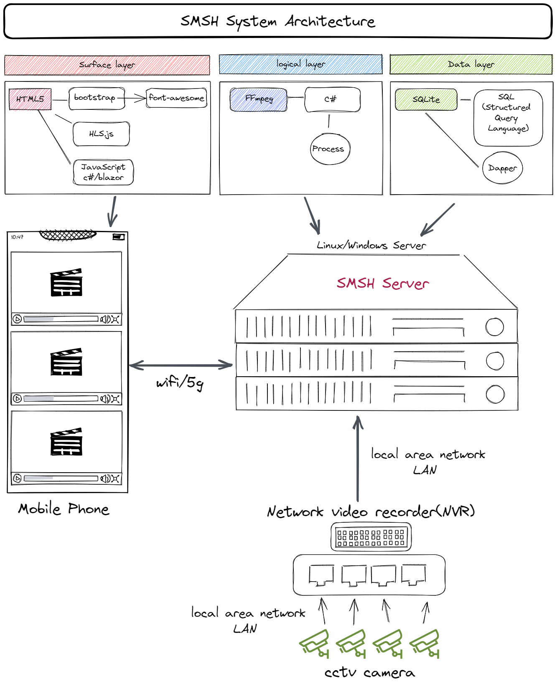

# SMSH - a simple media server for hospital (.NET6 Veriosn)

## System Architecture




# Technology Stack

### FFMpeg

**Download** <br/>
https://www.ffmpeg.org/download.html <br/>

**FFMPEG Quick Hacks** <br/>
http://www.vsubhash.in/ffmpeg-quick-hacks-book.html <br/>

**push rtsp sample**<br/>
```
ffmpeg -re -stream_loop -1 -i test.mp4 -vcodec h264 -acodec aac -f rtsp -rtsp_transport tcp rtsp://200.200.200.140:554/test1
ffmpeg -re -stream_loop -1 -i appletv.mp4 -vcodec h264 -acodec aac -f rtsp -rtsp_transport tcp rtsp://200.200.200.140:554/test2
ffmpeg -re -stream_loop -1 -i Beautiful.mp4 -vcodec h264 -acodec aac -f rtsp -rtsp_transport tcp rtsp://200.200.200.140:554/test3
ffmpeg -re -stream_loop -1 -i NewZealand.mp4 -vcodec h264 -acodec aac -f rtsp -rtsp_transport tcp rtsp://200.200.200.140:554/test4
```
**rtsp to hls sample** <br/>
```
ffmpeg.exe -i rtsp://200.200.200.140/test1 -fflags flush_packets -max_delay 2 -hls_flags delete_segments -hls_time 2 -g 30 test-1.m3u8
ffmpeg.exe -rtsp_transport tcp -i rtsp://200.200.200.140/test2 -fflags flush_packets -max_delay 5 -flags global_header -hls_time 5 -hls_list_size 3 -vcodec copy -y test-2.m3u8
ffmpeg.exe -i rtsp://200.200.200.140/test3 -fflags flush_packets -max_delay 2 -hls_flags delete_segments -hls_time 2 -g 30 test-3.m3u8
ffmpeg.exe -i rtsp://200.200.200.140/test4 -fflags flush_packets -max_delay 2 -hls_flags delete_segments -hls_time 2 -g 30 test-4.m3u8
```
IIS MIME Type for hls
```
.m3u8
application/x-mpegurl

.ts
video/vnd.dlna.mpeg-tts
```

**Books and other External Resources** <br/>
https://trac.ffmpeg.org/wiki/BooksAndOtherExternalResources

**VLC for Windows** <br>
https://www.videolan.org/vlc/download-windows.html

**EasyDarwin** <br>
https://github.com/EasyDarwin/EasyDarwin

**JavaScript**<br/>
https://developer.mozilla.org/en-US/docs/Web/JavaScript <br/>
https://developer.mozilla.org/zh-CN/docs/Web/JavaScript <br/>
https://www.w3schools.com/js/ <br/>

**HLS.js** <br/>
https://github.com/video-dev/hls.js/

**Bootstrap 5**<br/>
https://getbootstrap.com/docs/5.0/getting-started/introduction/

**Bootstrap Icons**<br/>
https://icons.getbootstrap.com/

**Hikvision 海康威视** <br/> 
https://www.cnblogs.com/stephenzengx/p/13673981.html <br/>
https://www.cnblogs.com/shuiche/p/12187275.html<br/>

**A Simple c# Wrapper for ffMpeg** <br/>
https://jasonjano.wordpress.com/2010/02/09/a-simple-c-wrapper-for-ffmpeg/ <br/>


**SQLite**<br/>
https://www.sqlite.org/index.html

**Dapper - a simple object mapper for .Net**<br/>
https://github.com/DapperLib/Dapper

**.NET 6.0**<br/>
https://visualstudio.microsoft.com/zh-hans/vs/ <br/>
https://dotnet.microsoft.com/en-us/download/dotnet/6.0


**Other tools**<br/>

excalidraw<br/>
https://excalidraw.com/

datagrip<br/>
https://www.jetbrains.com/datagrip/

SQLite and SQL Server Compact Toolbox <br/>
https://marketplace.visualstudio.com/items?itemName=ErikEJ.SQLServerCompactSQLiteToolbox

Firefox Browser Developer Edition<br/>
https://www.mozilla.org/en-GB/firefox/developer/

Google Web Fonts Helper<br/>
How to Host Google Fonts on Your Own Server<br/>
https://sebastiandedeyne.com/self-hosting-google-fonts/ <br/>
https://google-webfonts-helper.herokuapp.com/fonts <br/>
